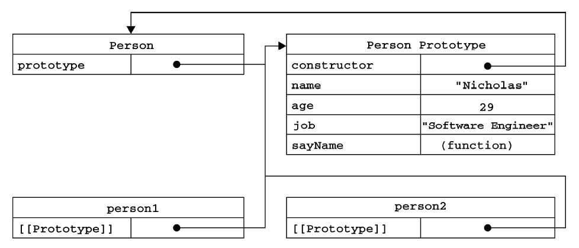

## 构造函数创建对象
  我们先使用构造函数创建一个对象：

```js
function Person() {

}
var person = New Person();
person.name = "liheng";
```

  在这个例子中，Person 就是一个构造函数，我们使用 new 创建了一个实例对象 person。

## prototype
  每个函数都有一个 prototype 属性，就是我们经常在各种例子中看到的那个 prototype ，比如： 

```js
function Person() {

}
Person.prototype.name = "liheng";
var person1 = new Person();
var person2 = new Person();
console.log(person1.name);
console.log(person2.name);
```

  那这个函数的prototype属性到底指向什么呢？是这个函数的原型吗？
  其实，函数的prototype属性指向了一个对象，这个对象正是调用该构造函数而创建的实例的原型，也就是这个例子中的person1和person2的原型。

  那什么是原型呢？你可以这样理解：每一个javaScript对象（null除外）在创建的时候就会与之关联另一个对象，这个对象就是我们所说的原型，每一个对象都会从原型继承属性。

  那么我们该怎么表示实例与实例原型，也就是 person 和 Person.prototype 之间的关系呢，这时候我们就要讲到第二个属性：
  
## __proto__
  这是每一个JavaScript对象（null除外）都具有的一个属性，叫proto__,这个属性会指向该对象的原型

```js
function Person() {
  
}
var person = new Person();
console.log(person.__proto__ === Person.prototype); // true
```

  下面是构造函数，实例原型，实例的关系图
  

  既然实例对象和构造函数都可以指向原型，那么原型是否有属性指向构造函数或者实例呢？

## constructor
  指向实例到时没有，因为一个构造函数可以生成多个实例，但是原型指向构造函数是有的，这就要讲到第三个属性：constructor，每个原型都有个constructor指向关联的构造函数。

```js
function Person() {

}
var person = new Person();
console.log(person.__proto__ === Person.prototype); // true
```

  更新一下关系图

  

  综上我们已经得出：

```js
function Person() {

}
var person = new Person();
console.log(person.__proto__ === Person.prototype);
console.log(Person.prototype.constructor === Person);
// 顺便学习一下ES5 的方法，可以获得对象的原型
console.log(Object.getPrototypeOf(person) === Person.prototype);
```

## 实例与原型
  当读取实例的属性时，如果找不到，就会查找与对象关联的原型中的属性，如果还查不到，就去找原型的原型，一直找到最顶层为止。
  举个例子:

```js
function Person(){

}
Person.prototype.name = "liheng";

var person = new Person();

person.name = "xu";

console.log(person.name); // liheng

delete person.name;

console.log(person.name); // xu
```

  从这个例子中，我们实例对象person 添加了name属性，当我们打印person.name的时候，结果自然为 liheng。

  但是当我们删除了person的name属性后，读取person.name，从person对象中找不到name属性就会从person的原型也就是person__proto__,也就是Person.prototype中查找。

  但是万一还没有找到呢？原型的原型又是什么呢？

## 原型的原型
  在前面，我们已经讲了原型也是一个对象，既然是对象，我们就可以用最原始的方式创建它，那就是：

```js
var obj = new Object();
```

  其实原型对象就是通过Object构造函数生成的，结合之前所讲，实例的 __proto__指向构造函数的prototype

## 原型链
  那Object.prototype的原型呢？

```js
console.log(Object.prototype.__proto__ === null) // true
```

  那么null代表什么呢？
  null表示没有"没有对象"，即此处不应该有值。

  所以查找属性查到 Object.prototype 就可以停止了。

  更新一下关系图
  

## 补充
  最后，补充三点大家可能不会注意的地方：

## constructor

  首先是constructor属性，我们看一个例子：

```js
function  Person() {

}
var person = new Person();
console.log(person.constructor === Person); // true
```

  当获取 person.constructor 时，其实person中并没有constructor属性，他会从persong的原型中找，就是Person.prototype中读取constructor属性，正好原型中有该属性，所以

```js
person.constructor === Person.prototype.constructor === Person
```

## \_\_proto\_\_
 其次是__proto__，绝大部门浏览器支持这个非标准的方法访问原型，然而它并不存在与Person.prototype中，实际上，它是来自与Object.prototype，与其说是一个属性，不如说是一个
 getter/setter，当使用 obj.__proto__时，可以理解成返回了Object.getPrototypeOf(obj)

## 真的是继承吗？
 最后关于继承，前面我们讲到"每一个对象都会从原型"继承"属性"，实际上，继承是一个十分具有迷惑性的说法：
 继承意味着复制操作，然而JavaScript默认不会复制对象的属性，相反，JavaScript只是在两个对象之间创建一个关联，这样，一个度一项就可以通过委托的方式访问另一个对象的属性和函数。


